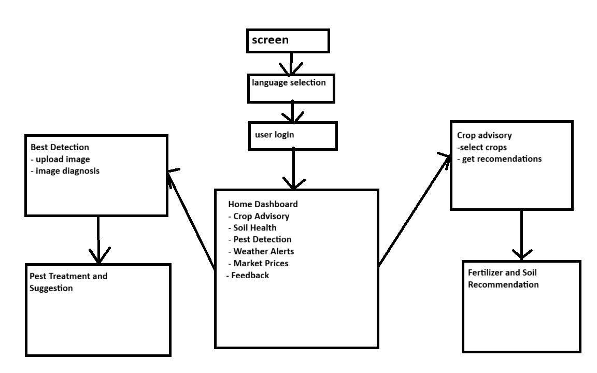
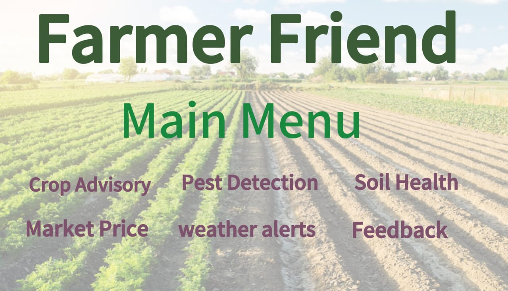

# Smart India Hackathon Workshop
# Date:30/09/2025
## Register Number:25003270
## Name:ASHFAK N
## Problem Title
SIH 25010: Smart Crop Advisory System for Small and Marginal Farmers
## Problem Description
A majority of small and marginal farmers in India rely on traditional knowledge, local shopkeepers, or guesswork for crop selection, pest control, and fertilizer use. They lack access to personalized, real-time advisory services that account for soil type, weather conditions, and crop history. This often leads to poor yield, excessive input costs, and environmental degradation due to overuse of chemicals. Language barriers, low digital literacy, and absence of localized tools further limit their access to modern agri-tech resources.

Impact / Why this problem needs to be solved

Helping small farmers make informed decisions can significantly increase productivity, reduce costs, and improve livelihoods. It also contributes to sustainable farming practices, food security, and environmental conservation. A smart advisory solution can empower farmers with scientific insights in their native language and reduce dependency on unreliable third-party advice.

Expected Outcomes

• A multilingual, AI-based mobile app or chatbot that provides real-time, location-specific crop advisory.
• Soil health recommendations and fertilizer guidance.
• Weather-based alerts and predictive insights.
• Pest/disease detection via image uploads.
• Market price tracking.
• Voice support for low-literate users.
• Feedback and usage data collection for continuous improvement.

Relevant Stakeholders / Beneficiaries

• Small and marginal farmers
• Agricultural extension officers
• Government agriculture departments
• NGOs and cooperatives
• Agri-tech startups

Supporting Data

• 86% of Indian farmers are small or marginal (NABARD Report, 2022).
• Studies show ICT-based advisories can increase crop yield by 20–30%.

## Problem Creater's Organization
Government of Punjab

## Theme
Agriculture, FoodTech & Rural Development

## Proposed Solution
App Name:Farmer’s Friend

Description:
Farmer's Friend is a multilingual, AI-powered mobile application designed specifically for small and marginal farmers in Punjab. It provides personalized, real-time crop advisory services based on soil health, weather conditions, pest detection, and market trends. The app supports voice interaction in Punjabi, Hindi, and English to cater to low-literacy users.

Key Features:

Personalized Crop Advisory: Recommendations on crop selection based on soil type, previous crop history, and local weather.
Soil Health & Fertilizer Guidance: Upload soil test reports or use soil sensor data to get fertilizer and nutrient management advice.
Weather Alerts & Predictive Insights: Real-time weather updates and forecasts to help plan irrigation and harvesting.
Pest/Disease Detection: Upload images of crops to identify pests/diseases using AI image recognition and get treatment suggestions.
Market Price Tracking: Real-time updates on crop prices in local mandis to help farmers decide the best time to sell.
Voice Support: Voice commands and responses in local languages for ease of use.
Feedback System: Collect user feedback and usage data to continuously improve advisory accuracy.

## Technical Approach
Frontend:

React Native for cross-platform mobile app development (Android/iOS).
Voice interface using Google Speech-to-Text and Text-to-Speech APIs supporting Punjabi, Hindi, and English.
Backend:

Node.js with Express.js for RESTful API services.
Python Flask/Django for AI model serving.
AI & Machine Learning:

TensorFlow/PyTorch for pest/disease image classification models.
Weather prediction models using time-series forecasting (LSTM networks).
Soil nutrient recommendation engine based on rule-based expert systems and ML.
Database:

PostgreSQL for structured data (user profiles, crop history, advisory data).
MongoDB for unstructured data (images, logs).
Cloud & DevOps:

AWS/GCP for scalable cloud infrastructure.
Serverless functions (AWS Lambda) for event-driven tasks like weather alerts.
CI/CD pipelines using GitHub Actions.
GIS & Location Services:

Google Maps API or OpenStreetMap for location-specific advisories.
Soil and weather data integration from government APIs (e.g., IMD, Soil Health Card portal).

## Feasibility and Viability
Low Digital Literacy-->Implement voice-based interaction and simple UI/UX with local language support.
Internet Connectivity Issues-->Enable offline mode with cached advisories and sync when online.
Data Privacy and Security-->Use encryption for data storage and transmission; comply with data protection laws.

## Impact and Benefits
Increased Crop Yield: Personalized advisories can improve yield by 20–30%, enhancing farmer income.
Cost Reduction: Optimized fertilizer and pesticide use reduces input costs and environmental harm.
Sustainable Farming: Promotes eco-friendly practices and reduces chemical overuse.
Empowerment: Farmers gain scientific knowledge in their native language, reducing dependency on unreliable sources.
Market Access: Real-time price tracking helps farmers get better market value for their produce.
Government Support: Data collected can help government agencies design better policies and extension programs.
Food Security: Improved productivity contributes to regional and national food security.

## Research and References
NABARD Report 2022 - Small and Marginal Farmers in India
URL: https://www.nabard.org/auth/writereaddata/tender/2106222143NABARD-Annual-Report-2021-22.pdf

ICT in Agriculture: Enhancing Crop Yield and Farmer Livelihoods
URL: https://www.fao.org/3/i3546e/i3546e.pdf

Indian Meteorological Department (IMD) Weather API
URL: https://mausam.imd.gov.in/api/

Soil Health Card Scheme - Government of India
URL: https://soilhealth.dac.gov.in/

Google Cloud Speech-to-Text API
URL: https://cloud.google.com/speech-to-text

TensorFlow Image Classification Tutorial
URL: https://www.tensorflow.org/tutorials/images/classification
